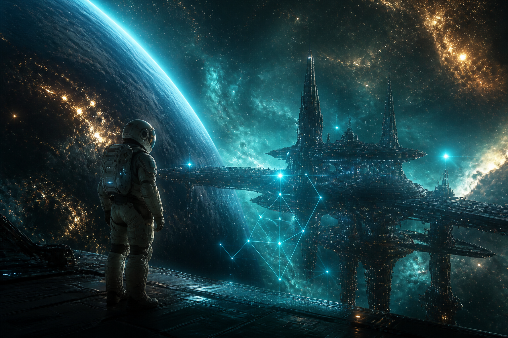

<!--
  Profile README — Felipe Fernandes
  Aesthetic: cinematic space / film splash — not pixel RPG, not chiptune.
  Live experience: https://felipeofdev-ai.github.io/
-->

  

 

# Felipe Fernandes

**Systems & Agentic AI Engineer** · Remote Brazil → Global

*I ship production systems where trust, citations, and human checkpoints matter —*  
*the craft bar Fortune‑500 engineering orgs hire for.*

**→ [Open the cinematic portfolio](https://felipeofdev-ai.github.io/)** · constellation of real products, not slides.

---

  

---

## Constellation · flagship systems

| System | What it proves |
|--------|----------------|
| [**TrustHire**](https://github.com/felipeofdev-ai/trusthire) | Hiring fraud defense — FastAPI risk signals before you trust an offer |
| [**BalcãoIA**](https://github.com/felipeofdev-ai/balcaoia-local) | Local commerce AI — catalog, scripts, compliance-first channels |
| [**BridgeTrace-AI**](https://github.com/felipeofdev-ai/BridgeTrace-AI) | Graph + GenAI finrisk explainability (synthetic data) |
| [**Meridian**](https://github.com/felipeofdev-ai/Meridian) | Append-only audit · Ed25519 · policy-minded governance |
| [**CardOpsAI**](https://github.com/felipeofdev-ai/CardOpsAI) | Payments risk OS — SQL-native operational intelligence |
| [**forge-mcp-server**](https://github.com/felipeofdev-ai/forge-mcp-server) | MCP tools for agent hosts — 2026 developer stack |
| [**agentic-rag-cite**](https://github.com/felipeofdev-ai/agentic-rag-cite) | RAG that refuses answers without citations |
| [**hitl-langgraph-kit**](https://github.com/felipeofdev-ai/hitl-langgraph-kit) | HITL interrupt before irreversible agent actions |
| [**aws-serverless-kit**](https://github.com/felipeofdev-ai/aws-serverless-kit) · [**azure-fn-starter**](https://github.com/felipeofdev-ai/azure-fn-starter) | Cloud labs — serverless patterns on AWS & Azure |

  <a href="https://felipeofdev-ai.github.io/"><strong>Explore interactively → felipeofdev-ai.github.io</strong></a>

---

## Stack

`TypeScript` `Next.js` `React` `Node.js` `Python` `FastAPI` `PostgreSQL` `Neo4j` `Docker` `AWS` `Azure` `MCP` `RAG` `LangGraph` `tRPC` `Zod`

> Certifications listed only with public credential URLs — never invented badges.

## Day work

- **WR IT Solutions** — Full-Stack · Vox2You multi-tenant SaaS (Next.js, tRPC, Neo4j)
- **Arsenal Elevadores** — Software Developer · CRM + ops (React, Node, PostgreSQL, Docker)

## Open source signal

[TheAlgorithms/Python](https://github.com/TheAlgorithms/Python) — **17 PRs** merged into a 218k★ repository.

Also: [generative-ai-playground](https://github.com/felipeofdev-ai/generative-ai-playground) · [philo-ai-os](https://github.com/felipeofdev-ai/philo-ai-os) · [trusthire-frontend](https://github.com/felipeofdev-ai/trusthire-frontend)

---

## Contact

| | |
|--|--|
| **Email** | [felipe.of.dev@gmail.com](mailto:felipe.of.dev@gmail.com) |
| **Portfolio** | [felipeofdev-ai.github.io](https://felipeofdev-ai.github.io/) |
| **LinkedIn** | [Felipe Fernandes](https://www.linkedin.com/in/felipe-de-oliveira-fernandes-941763110/) |
| **GitHub** | [felipeofdev-ai](https://github.com/felipeofdev-ai) |

  <b>Open to remote Senior Full-Stack / Backend / AI Engineer roles.</b> 
  Brief → inbox. Portfolio first if you prefer signal over PDFs.  
  <a href="https://felipeofdev-ai.github.io/"><strong>Enter Orbit</strong></a>
  ·
  <a href="mailto:felipe.of.dev@gmail.com">felipe.of.dev@gmail.com</a>

