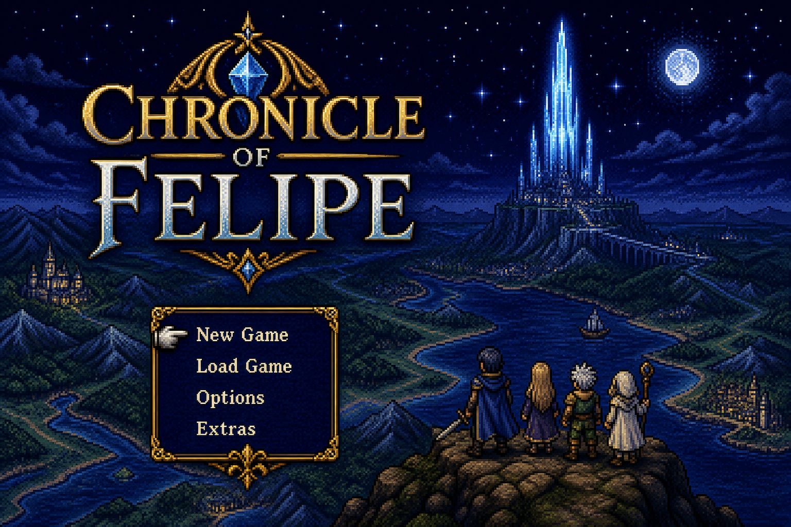
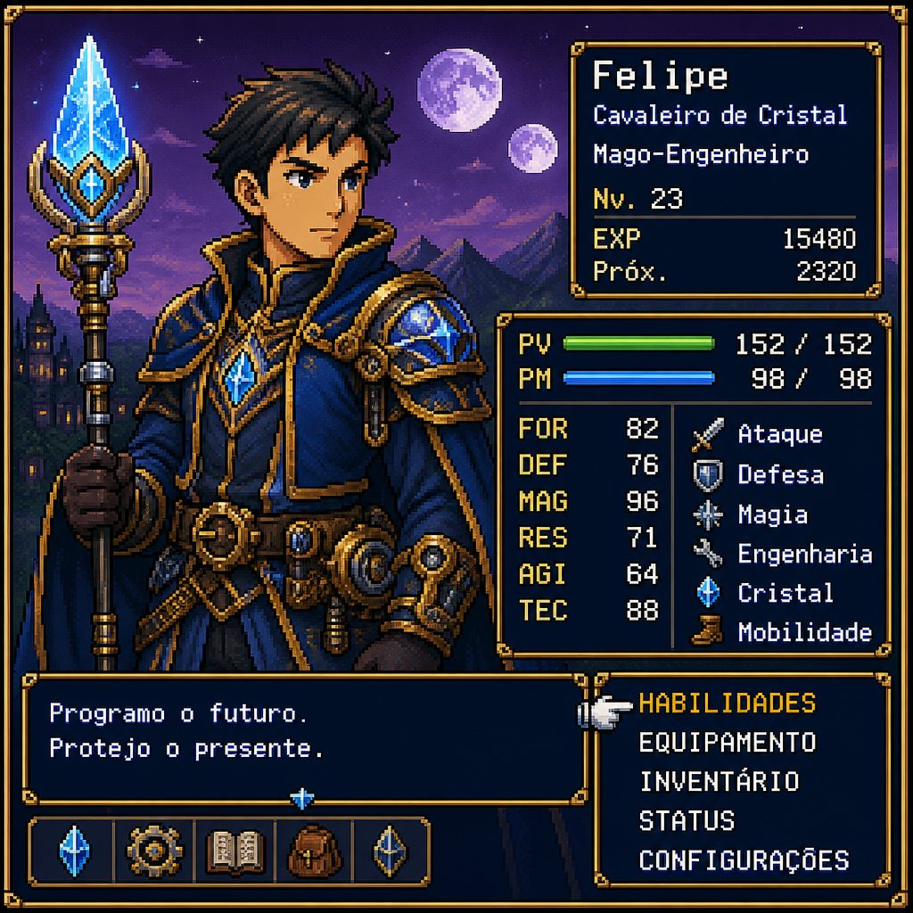

<!--
  CHRONICLE OF FELIPE — original 16-bit JRPG homage portal
  Playable game lives on GitHub Pages (README cannot run emulators/ROMs).
  No Final Fantasy ROM or copyrighted assets are redistributed.
-->

<div align="center">
  <a href="https://felipeofdev-ai.github.io/">
    
  </a>
</div>

<br/>

<div align="center">

```text
╔══════════════════════════════════════════════════════════╗
║          ★  C H R O N I C L E   O F   F E L I P E  ★     ║
║──────────────────────────────────────────────────────────║
║   NEW GAME                                      ● PLAY   ║
║   CONTINUE (GitHub constellation)                        ║
║   CONFIG  ·  music / voice on site                       ║
╚══════════════════════════════════════════════════════════╝
```

# FELIPE — Crystal Engineer · L99

**Class:** Systems & Agentic AI Engineer  
**Job:** Full-Stack · Agents · Trust Systems  
**Realm:** São José dos Campos → Remote Global

[](https://felipeofdev-ai.github.io/)
[](mailto:felipe.of.dev@gmail.com)
[](https://www.linkedin.com/in/felipe-de-oliveira-fernandes-941763110/)



</div>

---

<div align="center">

### ⚔️ You don’t read this README — you **play** it

Walk the overworld → attune crystals → open real GitHub quests  
*(Original homage to classic SNES JRPG UX — **not** Final Fantasy / Nintendo IP.)*

**→ [https://felipeofdev-ai.github.io/](https://felipeofdev-ai.github.io/)**

</div>

---

## 🗺️ Party status

```text
 FELIPE ................. HP ████████████░░  MP ███████████░░░
 Class: Crystal Engineer  XP ████████░░░░░░  4+ yrs production
```

| Crystal | Quest | Why recruiters care |
|---------|-------|---------------------|
| 🛡️ TrustHire | [repo](https://github.com/felipeofdev-ai/trusthire) | Fraud / hiring-scam AI |
| 📜 Meridian | [repo](https://github.com/felipeofdev-ai/Meridian) | Append-only audit governance |
| 🧬 PHILO AI OS | [repo](https://github.com/felipeofdev-ai/philo-ai-os) | Multi-agent / multi-LLM OS |
| 🕸️ BridgeTrace | [repo](https://github.com/felipeofdev-ai/BridgeTrace-AI) | Graph + GenAI finrisk |
| ⚒️ Forge MCP | [repo](https://github.com/felipeofdev-ai/forge-mcp-server) | MCP tools (2026 hiring signal) |
| 📚 RAG Cite | [repo](https://github.com/felipeofdev-ai/agentic-rag-cite) | Citation-mandatory RAG |
| ⏸️ HITL Kit | [repo](https://github.com/felipeofdev-ai/hitl-langgraph-kit) | interrupt() before irreversible acts |

**Inventory:** `TypeScript` `Next.js` `Python/FastAPI` `PostgreSQL` `Neo4j` `Docker` `AWS hands-on` `LangGraph patterns` `MCP` `Zod`

---

## 🏰 Day-job guilds

- **WR IT Solutions** — Full-Stack · Vox2You multi-tenant SaaS  
- **Arsenal Elevadores** — Software Developer · CRM + ops  

## 🌟 Raid clears (OSS)

- **TheAlgorithms/Python** — 17+ PRs · new: Tonelli–Shanks, BSGS  
- **home-assistant/core** — OpenAI Conversation quality-scale  
- **NVIDIA/cutlass · Nubank · Bevy · Godot** — recent prestige PRs  

---

## 📣 How to recruit in one dungeon run

1. [Play the Chronicle](https://felipeofdev-ai.github.io/)  
2. Clear TrustHire + Meridian + MCP crystals  
3. Send party invite → `felipe.of.dev@gmail.com`

---

<p align="center">
  <i>Original game presentation. No ROMs redistributed. Career facts only.</i><br/>
  <b>Looking for a party that values trust, citations, and shipping.</b>
</p>
